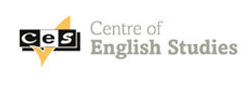

# Lucy King | C.V.

Full-stack JavaScript developer.

Student at Founders & Coders, a brilliant peer-led web development bootcamp in London.

I'm passionate about the potential of technology to solve problems and make our world better. Looking for an environment which offers opportunities to learn, to write clean and accessible code, to be creative and to work collaboratively. 

[Skills](#skills) | [Projects](#projects) | [Work](#work) | [Education](#education) | [Interests](#interests) | [Contact](#contact) 

## <a name="skills">Skills

I have worked on a variety of projects using the following technologies.

| Languages       | Frameworks/Libraries  | Testing       | Design       | Databases  | Tools/Others     |
| :-------------: | :-------------------: | :-----------: | :----------: | :--------: | :--------------: |
| JavaScript      | Node.js          	  | TDD with Tape | InVision     | PostgreSQL | Git & GitHub     |
| HTML5       	  | Express.js        	  | Travis CI 	  | Figma        |            | Heroku           |
| CSS3		      | Handlebars            | CodeCov       |              |            | Accessibility    |
| R               |                       | QUnit         |              |            |                  |
| Markdown		  | 					  |				  |			     |            |	   				 |

## <a name="projects">Projects

Check out my [portfolio](https://github.com/lucymk/portfolio)

## <a name="work">Work

## <a name="education">Education

### Founders & Coders

A 16 week full time Javascript course learning the fundamentals of front and backend development. Working in teams, pair programming, testing and paying close attention to UX. Completing weekly projects following agile methodologies. Weekly talks from experts in industry on topics such as accessibility, AI, performance, PWAs and security. 

### Centre of English Studies

__2016__ CELTA Qualification (Certificate in Teaching English to Speakers of Other Languages) 

### University of Bristol

BSc. Mathematics & Philosophy, 2:1 (2010-2013)

### St. Margaret's School, Edinburgh							    

__2009__ Advanced Highers: Maths, Physics (AA)
__2008__ Highers: Maths, Physics, Chemistry, English, German, Modern Studies (AAAAAA)

## <a name="interests">Interests

## <a name="contact">Contact

Email: lucy.m.king92@gmail.com
Gitter: @lucymk